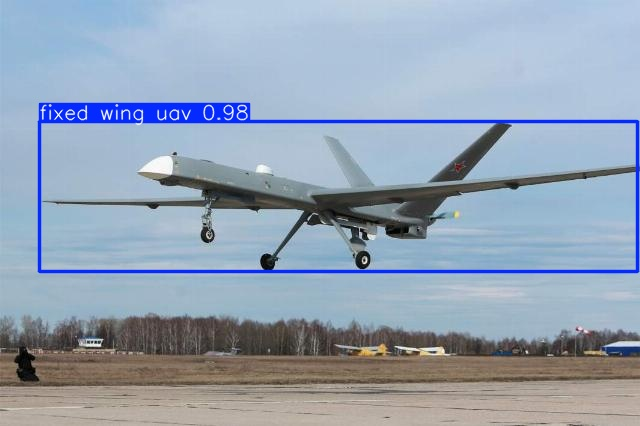

<h1 align=center>Fixed-Wing Unmanned Aerial Vehicles (UAVs) Detection </h1>

  
  
  
  
  
  
  
  

</img>

Motivation
---
Driven by the defense, agriculture, and surveying sectors, the use of fixed-wing **U**nmanned **A**erial **V**ehicles (UAVs) has grown significantly in recent years. Alongside this rapid expansion, detecting fixed-wing aircraft in images or video streams has become essential for maintaining safe and efficient airspace operations. This capability plays a crucial role in preventing collisions, managing air traffic, ensuring security, and enhancing UAV coordination.

The goal of this project is to create a deep learning model capable of detecting fixed-wing UAVs in real time, suited for deployment on edge devices.

Dataset
---
A dataset of 735 unique fixed-wing UAVs images was collected and annotated with bounding boxes for detection tasks. The annotation process was carried out using [Label Studio](https://labelstud.io/). An initial YOLO model trained on a small subset of the data was integrated as ML-backend for "human-in-the-loop" annotations.

Model
---
A lightweight YOLO model (2.6M parameters) was trained on the dataset using [Ultralytics](https://docs.ultralytics.com/). During model development, experiments were tracked using [MLFlow](https://mlflow.org/), and training parameters were tuned using [Ray Tune](https://docs.ray.io/en/latest/tune/index.html).

